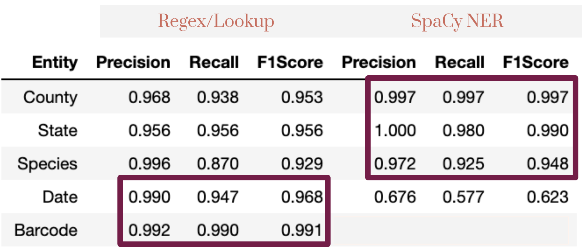

# ocr_images
Entity Extraction from botanical images using Optical Character Recognition (OCR) and Natural Language Processing (NLP)

## Introduction
This project extracts raw text from botanical specimen images using OCR with Google Pytesseract and Google Vision API; it then extracts entities (barcode, location, species name, collector, date) from this raw text.

## Project Motivation
The project was completed for startup solving the problem of entity extraction for a huge number of scanned images at a botanical garden.

## Files

- model 
 -- train_ner.py - Train custom NER model in SpaCy 
 -- ocr.py - OCR extraction using PyTesseract and Google Vision API 
 -- helper.py - ntity extraction model inference 
- data 
 -- handwritten_train.csv - Train data to train handwritten model 
 -- printed_train.csv - Train data to train printed model 
 -- printed_raw_ocr_data.csv - Test data for model prediction/evaluation 
 -- States.csv. Lookup table for states 
 -- PlantSpecies.csv - Lookup table for plant species names 
- Handwritten_Prediction_Analysis.ipynb - Prediction/evaluation for handwritten text images 
- Printed_Prediction_Analysis.ipynb - Prediction/evaluation for printed text images 
- requirements.txt - List of libraries required 
- app.py. Streamlit app 

## Instructions for running the scripts:
1. Run the following commands in the project's root directory to set up your database and model.

    - python model/train_ner.py data/printed_train.csv model/printed_model
    - python model/train_ner.py data/handwritten_train.csv model/handwritten_model

2. Run the following command in the app's directory to run your web app.
    
    - streamlit run app.py

3. Go to http://0.0.0.0:8502/

## Examples

Below are examples of entity extraction with the streamlit app.

## Results

Printed Text Model Evaluation

Sources of Error

Handwritten Text Model Evaluation

